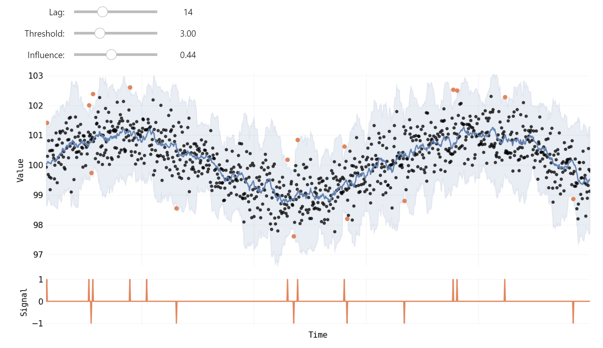

# An Effective Anomaly Detection Algorithm

## How it works

This threshold based anomaly detection algorithm works by identifying data points that significantly deviate from the expected pattern of a time series. 

It does this by using a moving average and standard deviation filter to estimate the expected value ranges of the time series at each point in time. **If a data point falls outside a certain number of standard deviations from the moving average, it is considered an anomaly.**

Here's a step-by-step explanation of how the algorithm works:

* Calculate the moving average and standard deviation of the time series over a window of a fixed size (specified by the lag parameter).
* Calculate the upper and lower bounds for the time series values based on the moving average and standard deviation, using a threshold specified by the threshold parameter.
* For each data point in the time series, calculate whether it is outside the upper or lower bounds.
* If a data point is outside the bounds, mark it as an anomaly by assigning it a value of +1 or -1 (depending on whether it is above or below the upper or lower bound, respectively).
* If a data point is not outside the bounds, it is considered normal and assigned a value of 0.
* Optionally, smooth the time series by replacing anomalous values with a weighted average of the previous value and the current value, where the weight is specified by the influence parameter. In other words, influence is a parameter that determines how much an anomaly affects the subsequent moving average and standard deviation calculations.
* Repeat steps 1-6 for the rest of the time series.

The algorithm outputs a dictionary containing the signals (an array of +1, -1, or 0 indicating whether each data point is anomalous or not), the moving average, and the standard deviation.

The output can be plotted using the plot() method, which shows the original time series data along with the moving average, upper and lower bounds, and markers for anomalous data points.

## **Algorithms**

Currently there are **three** flavours implemented here:

 * **ThresholdingAnomalyDetector**: This is the standard algorithm described above
 
 * **EMAAnomalyDetector**: This has an additional paramater, `alpha`, which determines the degree of weighting for recent data points compared to older data points. More detail later on.
 
 * **RealTimeAnomalyDetector**: This implementation uses only the data available at the time of detection, therefore produces different results that the algorithms above.
 
 
## **Important Assumptions**
 
* **Stationarity**: The data is assumed to be stationary, meaning that the statistical properties such as mean and standard deviation are constant over time. This is because the moving average and standard deviation are calculated over a sliding window and used to detect anomalies. If the underlying data is non-stationary, the algorithm may have trouble adapting to changes in the mean and standard deviation over time.

* **Normality**: The algorithm implicitly assumes that the data follows a Gaussian or normal distribution. This is due to the usage of the standard deviation for establishing the threshold. In a normal distribution, about 68% of values lie within one standard deviation of the mean, 95% lie within two, and 99.7% lie within three. If the data is not normally distributed, this percentage can vary, which might affect the performance of the anomaly detection.

* **Independence**: The data points are assumed to be independent of each other. The algorithm does not account for any potential correlation between different data points. If the data points are not independent, the presence of an anomaly could be correlated with the presence of other anomalies, which this algorithm would not detect.

 
## Advantages:

* The algorithm is simple to implement and understand.
* It is effective in detecting anomalies that are significantly different from normal behavior.
* It does not require a labeled dataset for training, making it suitable for unsupervised anomaly detection tasks.
* It can detect anomalies in real-time, making it useful in applications where prompt detection is important.
* It can be applied to various types of time-series data, such as stock prices, server logs, and sensor data.

## Limitations:

* It may not be effective in detecting subtle anomalies that are close to the boundary of normal behavior.
* The threshold parameter is subjective and may require some trial-and-error to find the optimal value.
* It assumes that the time-series data is stationary, i.e., its statistical properties do not change over time.
* It may produce false positives if the data has a high level of noise or if there are sudden changes in the data that are not anomalies.
* It may not be suitable for data that has a large number of missing values or outliers, good preprocessing could help here.

